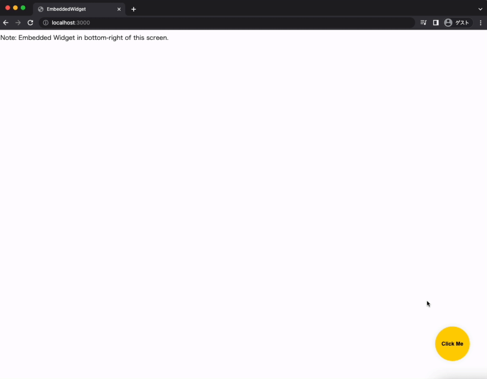

<div align="center">
  <a href="https://github.com/kyaukyuai/typescript-react-embedded-widget-starter">
    
  </a>
</div>

<h2 align="center">
typescript-react-embedded-widget-starter
</h2>

[](https://open.vscode.dev/kyaukyuai/typescript-react-embedded-widget-starter)
[](https://renovatebot.com/)
[](https://github.com/kyaukyuai/typescript-react-embedded-widget-starter/issues)


## DEMO



## Features

- Obfuscating of the code
- No css styling conflicts between the host page and the widget (with https://github.com/premasagar/cleanslate)

## Running the widget

### Install dependencies

```bash
$ yarn install
```

### Start the development server

```bash
$ yarn dev
```

### Production build

```bash
yarn build
```

## Road map

- [ ] Unit Tested with code coverage enabled
- [ ] Continuous Integration ready